# Forecasting System - Project Demand of Products at a Retail Outlet Based on Historical Data


```python
#Importing necessary libraries
import pandas as pd
import numpy as np
import matplotlib.pyplot as plt
import seaborn as sns
import datetime as dt
from pandas import Grouper
from statsmodels.tsa.stattools import adfuller
from numpy import log
import statsmodels.api as sm
from statsmodels.graphics.tsaplots import plot_acf, plot_pacf
from statsmodels.tsa.statespace.sarimax import SARIMAX
from sklearn.metrics import mean_squared_error
import warnings 
warnings.filterwarnings('ignore')
```


```python
#importing the dataset
df = pd.read_csv("store_sales_data.csv")
```


```python
#Displaying the dataframe
df.head(5)
```


<div>
<style scoped>
    .dataframe tbody tr th:only-of-type {
        vertical-align: middle;
    }

    .dataframe tbody tr th {
        vertical-align: top;
    }

    .dataframe thead th {
        text-align: right;
    }
</style>
<table border="1" class="dataframe">
  <thead>
    <tr style="text-align: right;">
      <th></th>
      <th>date</th>
      <th>store</th>
      <th>item</th>
      <th>sales</th>
    </tr>
  </thead>
  <tbody>
    <tr>
      <th>0</th>
      <td>2013-01-01</td>
      <td>1</td>
      <td>1</td>
      <td>13</td>
    </tr>
    <tr>
      <th>1</th>
      <td>2013-01-02</td>
      <td>1</td>
      <td>1</td>
      <td>11</td>
    </tr>
    <tr>
      <th>2</th>
      <td>2013-01-03</td>
      <td>1</td>
      <td>1</td>
      <td>14</td>
    </tr>
    <tr>
      <th>3</th>
      <td>2013-01-04</td>
      <td>1</td>
      <td>1</td>
      <td>13</td>
    </tr>
    <tr>
      <th>4</th>
      <td>2013-01-05</td>
      <td>1</td>
      <td>1</td>
      <td>10</td>
    </tr>
  </tbody>
</table>
</div>


```python
#Checking the shape af the dataset
df.shape
```


    (913000, 4)


```python
#Unique values in each column
df.nunique()
```


    date     1826
    store      10
    item       50
    sales     213
    dtype: int64


```python
#Datatypes of the features and target
df.dtypes
```


    date     object
    store     int64
    item      int64
    sales     int64
    dtype: object


**The original dataset is reduced**
* Sales data of single store (store 1) is taken for further analysis,
  forecasting and model building


```python
#Store 1 data converted to separate dataframe
data = df[df['store']==1]
```


```python
data.head(5)
```


<div>
<style scoped>
    .dataframe tbody tr th:only-of-type {
        vertical-align: middle;
    }

    .dataframe tbody tr th {
        vertical-align: top;
    }

    .dataframe thead th {
        text-align: right;
    }
</style>
<table border="1" class="dataframe">
  <thead>
    <tr style="text-align: right;">
      <th></th>
      <th>date</th>
      <th>store</th>
      <th>item</th>
      <th>sales</th>
    </tr>
  </thead>
  <tbody>
    <tr>
      <th>0</th>
      <td>2013-01-01</td>
      <td>1</td>
      <td>1</td>
      <td>13</td>
    </tr>
    <tr>
      <th>1</th>
      <td>2013-01-02</td>
      <td>1</td>
      <td>1</td>
      <td>11</td>
    </tr>
    <tr>
      <th>2</th>
      <td>2013-01-03</td>
      <td>1</td>
      <td>1</td>
      <td>14</td>
    </tr>
    <tr>
      <th>3</th>
      <td>2013-01-04</td>
      <td>1</td>
      <td>1</td>
      <td>13</td>
    </tr>
    <tr>
      <th>4</th>
      <td>2013-01-05</td>
      <td>1</td>
      <td>1</td>
      <td>10</td>
    </tr>
  </tbody>
</table>
</div>


```python
data.shape
```


    (91300, 4)


```python
data.nunique()
```


    date     1826
    store       1
    item       50
    sales     150
    dtype: int64


```python
#Droping the store column since only one datapoint in the column
data = data.drop('store',axis=1)
```


```python
#Saving new dataframe to separate csv file
data.to_csv("data.csv")
```


```python
data.head(5)
```


<div>
<style scoped>
    .dataframe tbody tr th:only-of-type {
        vertical-align: middle;
    }

    .dataframe tbody tr th {
        vertical-align: top;
    }

    .dataframe thead th {
        text-align: right;
    }
</style>
<table border="1" class="dataframe">
  <thead>
    <tr style="text-align: right;">
      <th></th>
      <th>date</th>
      <th>item</th>
      <th>sales</th>
    </tr>
  </thead>
  <tbody>
    <tr>
      <th>0</th>
      <td>2013-01-01</td>
      <td>1</td>
      <td>13</td>
    </tr>
    <tr>
      <th>1</th>
      <td>2013-01-02</td>
      <td>1</td>
      <td>11</td>
    </tr>
    <tr>
      <th>2</th>
      <td>2013-01-03</td>
      <td>1</td>
      <td>14</td>
    </tr>
    <tr>
      <th>3</th>
      <td>2013-01-04</td>
      <td>1</td>
      <td>13</td>
    </tr>
    <tr>
      <th>4</th>
      <td>2013-01-05</td>
      <td>1</td>
      <td>10</td>
    </tr>
  </tbody>
</table>
</div>


```python
#Converting the datatype of date to datetime format
data['date'] = pd.to_datetime(data['date'],format='%Y-%m-%d') 
```


```python
# Get the start and end date of the data
start_date = data['date'].min()
end_date = data['date'].max()
```


```python
# Set the date column as the index of the dataframe
data = data.set_index('date')
```


```python
data.head(5)
```


<div>
<style scoped>
    .dataframe tbody tr th:only-of-type {
        vertical-align: middle;
    }

    .dataframe tbody tr th {
        vertical-align: top;
    }

    .dataframe thead th {
        text-align: right;
    }
</style>
<table border="1" class="dataframe">
  <thead>
    <tr style="text-align: right;">
      <th></th>
      <th>item</th>
      <th>sales</th>
    </tr>
    <tr>
      <th>date</th>
      <th></th>
      <th></th>
    </tr>
  </thead>
  <tbody>
    <tr>
      <th>2013-01-01</th>
      <td>1</td>
      <td>13</td>
    </tr>
    <tr>
      <th>2013-01-02</th>
      <td>1</td>
      <td>11</td>
    </tr>
    <tr>
      <th>2013-01-03</th>
      <td>1</td>
      <td>14</td>
    </tr>
    <tr>
      <th>2013-01-04</th>
      <td>1</td>
      <td>13</td>
    </tr>
    <tr>
      <th>2013-01-05</th>
      <td>1</td>
      <td>10</td>
    </tr>
  </tbody>
</table>
</div>


```python
# Create a series of all the days within the date range
all_days = pd.date_range(start_date, end_date, freq='D')
# Resample the data to daily frequency and take the sum of sales for each day
daily_data = data.resample('D').sum()
```


```python
# Check for missing days
missing_days = daily_data[daily_data.isna().any(axis=1)]
```


```python
# Print the missing days
print(missing_days)
```

    Empty DataFrame
    Columns: [item, sales]
    Index: []
    

### Exploratory Data Analysis

**Itemwise descriptive statistics**


```python
data.groupby('item')['sales'].describe()
```


<div>
<style scoped>
    .dataframe tbody tr th:only-of-type {
        vertical-align: middle;
    }

    .dataframe tbody tr th {
        vertical-align: top;
    }

    .dataframe thead th {
        text-align: right;
    }
</style>
<table border="1" class="dataframe">
  <thead>
    <tr style="text-align: right;">
      <th></th>
      <th>count</th>
      <th>mean</th>
      <th>std</th>
      <th>min</th>
      <th>25%</th>
      <th>50%</th>
      <th>75%</th>
      <th>max</th>
    </tr>
    <tr>
      <th>item</th>
      <th></th>
      <th></th>
      <th></th>
      <th></th>
      <th></th>
      <th></th>
      <th></th>
      <th></th>
    </tr>
  </thead>
  <tbody>
    <tr>
      <th>1</th>
      <td>1826.0</td>
      <td>19.971522</td>
      <td>6.741022</td>
      <td>4.0</td>
      <td>15.00</td>
      <td>19.0</td>
      <td>24.00</td>
      <td>50.0</td>
    </tr>
    <tr>
      <th>2</th>
      <td>1826.0</td>
      <td>53.148959</td>
      <td>15.005779</td>
      <td>13.0</td>
      <td>43.00</td>
      <td>52.0</td>
      <td>63.00</td>
      <td>115.0</td>
    </tr>
    <tr>
      <th>3</th>
      <td>1826.0</td>
      <td>33.208105</td>
      <td>10.072529</td>
      <td>8.0</td>
      <td>26.00</td>
      <td>33.0</td>
      <td>40.00</td>
      <td>70.0</td>
    </tr>
    <tr>
      <th>4</th>
      <td>1826.0</td>
      <td>19.956188</td>
      <td>6.640618</td>
      <td>4.0</td>
      <td>15.00</td>
      <td>20.0</td>
      <td>24.00</td>
      <td>43.0</td>
    </tr>
    <tr>
      <th>5</th>
      <td>1826.0</td>
      <td>16.612815</td>
      <td>5.672102</td>
      <td>3.0</td>
      <td>13.00</td>
      <td>16.0</td>
      <td>20.00</td>
      <td>37.0</td>
    </tr>
    <tr>
      <th>6</th>
      <td>1826.0</td>
      <td>53.060789</td>
      <td>14.826416</td>
      <td>17.0</td>
      <td>42.00</td>
      <td>52.0</td>
      <td>63.00</td>
      <td>104.0</td>
    </tr>
    <tr>
      <th>7</th>
      <td>1826.0</td>
      <td>52.783680</td>
      <td>15.073838</td>
      <td>14.0</td>
      <td>42.00</td>
      <td>52.0</td>
      <td>63.00</td>
      <td>115.0</td>
    </tr>
    <tr>
      <th>8</th>
      <td>1826.0</td>
      <td>69.472070</td>
      <td>18.751980</td>
      <td>24.0</td>
      <td>56.00</td>
      <td>68.5</td>
      <td>83.00</td>
      <td>137.0</td>
    </tr>
    <tr>
      <th>9</th>
      <td>1826.0</td>
      <td>46.504929</td>
      <td>13.247496</td>
      <td>14.0</td>
      <td>37.00</td>
      <td>46.0</td>
      <td>55.00</td>
      <td>94.0</td>
    </tr>
    <tr>
      <th>10</th>
      <td>1826.0</td>
      <td>66.354326</td>
      <td>18.283007</td>
      <td>16.0</td>
      <td>53.00</td>
      <td>65.0</td>
      <td>79.00</td>
      <td>131.0</td>
    </tr>
    <tr>
      <th>11</th>
      <td>1826.0</td>
      <td>63.217963</td>
      <td>17.230417</td>
      <td>11.0</td>
      <td>51.00</td>
      <td>62.0</td>
      <td>75.00</td>
      <td>124.0</td>
    </tr>
    <tr>
      <th>12</th>
      <td>1826.0</td>
      <td>63.233844</td>
      <td>17.636872</td>
      <td>21.0</td>
      <td>50.00</td>
      <td>62.0</td>
      <td>74.00</td>
      <td>133.0</td>
    </tr>
    <tr>
      <th>13</th>
      <td>1826.0</td>
      <td>76.159365</td>
      <td>20.374852</td>
      <td>27.0</td>
      <td>61.00</td>
      <td>75.0</td>
      <td>91.00</td>
      <td>139.0</td>
    </tr>
    <tr>
      <th>14</th>
      <td>1826.0</td>
      <td>53.148959</td>
      <td>14.769971</td>
      <td>20.0</td>
      <td>42.00</td>
      <td>52.0</td>
      <td>63.00</td>
      <td>107.0</td>
    </tr>
    <tr>
      <th>15</th>
      <td>1826.0</td>
      <td>79.680723</td>
      <td>21.725799</td>
      <td>17.0</td>
      <td>64.00</td>
      <td>78.0</td>
      <td>94.00</td>
      <td>154.0</td>
    </tr>
    <tr>
      <th>16</th>
      <td>1826.0</td>
      <td>23.332421</td>
      <td>7.614738</td>
      <td>5.0</td>
      <td>18.00</td>
      <td>23.0</td>
      <td>29.00</td>
      <td>55.0</td>
    </tr>
    <tr>
      <th>17</th>
      <td>1826.0</td>
      <td>29.972070</td>
      <td>9.116824</td>
      <td>9.0</td>
      <td>23.00</td>
      <td>29.0</td>
      <td>36.00</td>
      <td>61.0</td>
    </tr>
    <tr>
      <th>18</th>
      <td>1826.0</td>
      <td>76.345564</td>
      <td>21.053109</td>
      <td>28.0</td>
      <td>61.00</td>
      <td>75.0</td>
      <td>90.00</td>
      <td>155.0</td>
    </tr>
    <tr>
      <th>19</th>
      <td>1826.0</td>
      <td>36.676889</td>
      <td>11.100620</td>
      <td>11.0</td>
      <td>29.00</td>
      <td>36.0</td>
      <td>44.00</td>
      <td>75.0</td>
    </tr>
    <tr>
      <th>20</th>
      <td>1826.0</td>
      <td>42.890471</td>
      <td>12.181551</td>
      <td>11.0</td>
      <td>34.00</td>
      <td>42.0</td>
      <td>51.00</td>
      <td>87.0</td>
    </tr>
    <tr>
      <th>21</th>
      <td>1826.0</td>
      <td>36.176342</td>
      <td>10.840796</td>
      <td>9.0</td>
      <td>28.00</td>
      <td>35.0</td>
      <td>43.00</td>
      <td>74.0</td>
    </tr>
    <tr>
      <th>22</th>
      <td>1826.0</td>
      <td>72.781490</td>
      <td>19.808007</td>
      <td>25.0</td>
      <td>58.00</td>
      <td>72.0</td>
      <td>86.00</td>
      <td>143.0</td>
    </tr>
    <tr>
      <th>23</th>
      <td>1826.0</td>
      <td>26.469880</td>
      <td>8.460734</td>
      <td>5.0</td>
      <td>20.00</td>
      <td>26.0</td>
      <td>32.00</td>
      <td>55.0</td>
    </tr>
    <tr>
      <th>24</th>
      <td>1826.0</td>
      <td>60.000000</td>
      <td>16.642840</td>
      <td>18.0</td>
      <td>48.00</td>
      <td>59.0</td>
      <td>71.00</td>
      <td>121.0</td>
    </tr>
    <tr>
      <th>25</th>
      <td>1826.0</td>
      <td>72.736035</td>
      <td>19.799388</td>
      <td>24.0</td>
      <td>57.00</td>
      <td>72.0</td>
      <td>86.00</td>
      <td>143.0</td>
    </tr>
    <tr>
      <th>26</th>
      <td>1826.0</td>
      <td>43.236035</td>
      <td>12.848906</td>
      <td>12.0</td>
      <td>34.00</td>
      <td>43.0</td>
      <td>52.00</td>
      <td>96.0</td>
    </tr>
    <tr>
      <th>27</th>
      <td>1826.0</td>
      <td>20.050931</td>
      <td>6.640278</td>
      <td>1.0</td>
      <td>15.00</td>
      <td>20.0</td>
      <td>24.75</td>
      <td>48.0</td>
    </tr>
    <tr>
      <th>28</th>
      <td>1826.0</td>
      <td>79.566813</td>
      <td>21.460002</td>
      <td>32.0</td>
      <td>63.00</td>
      <td>79.0</td>
      <td>94.00</td>
      <td>155.0</td>
    </tr>
    <tr>
      <th>29</th>
      <td>1826.0</td>
      <td>63.086528</td>
      <td>17.277086</td>
      <td>19.0</td>
      <td>50.00</td>
      <td>62.0</td>
      <td>75.00</td>
      <td>124.0</td>
    </tr>
    <tr>
      <th>30</th>
      <td>1826.0</td>
      <td>36.318182</td>
      <td>10.938036</td>
      <td>13.0</td>
      <td>28.00</td>
      <td>36.0</td>
      <td>43.75</td>
      <td>72.0</td>
    </tr>
    <tr>
      <th>31</th>
      <td>1826.0</td>
      <td>53.008215</td>
      <td>14.954009</td>
      <td>15.0</td>
      <td>42.00</td>
      <td>52.0</td>
      <td>63.00</td>
      <td>106.0</td>
    </tr>
    <tr>
      <th>32</th>
      <td>1826.0</td>
      <td>39.837897</td>
      <td>11.464108</td>
      <td>13.0</td>
      <td>32.00</td>
      <td>39.0</td>
      <td>47.00</td>
      <td>81.0</td>
    </tr>
    <tr>
      <th>33</th>
      <td>1826.0</td>
      <td>62.755750</td>
      <td>17.178149</td>
      <td>23.0</td>
      <td>50.00</td>
      <td>62.0</td>
      <td>74.00</td>
      <td>123.0</td>
    </tr>
    <tr>
      <th>34</th>
      <td>1826.0</td>
      <td>23.274918</td>
      <td>7.499406</td>
      <td>5.0</td>
      <td>18.00</td>
      <td>23.0</td>
      <td>28.00</td>
      <td>48.0</td>
    </tr>
    <tr>
      <th>35</th>
      <td>1826.0</td>
      <td>59.495071</td>
      <td>16.482759</td>
      <td>20.0</td>
      <td>47.00</td>
      <td>58.0</td>
      <td>70.00</td>
      <td>115.0</td>
    </tr>
    <tr>
      <th>36</th>
      <td>1826.0</td>
      <td>69.309967</td>
      <td>19.170648</td>
      <td>24.0</td>
      <td>55.00</td>
      <td>68.0</td>
      <td>83.00</td>
      <td>151.0</td>
    </tr>
    <tr>
      <th>37</th>
      <td>1826.0</td>
      <td>26.424425</td>
      <td>8.312726</td>
      <td>8.0</td>
      <td>20.00</td>
      <td>26.0</td>
      <td>32.00</td>
      <td>62.0</td>
    </tr>
    <tr>
      <th>38</th>
      <td>1826.0</td>
      <td>73.344469</td>
      <td>19.948156</td>
      <td>19.0</td>
      <td>58.25</td>
      <td>72.0</td>
      <td>87.00</td>
      <td>150.0</td>
    </tr>
    <tr>
      <th>39</th>
      <td>1826.0</td>
      <td>39.694962</td>
      <td>11.783459</td>
      <td>13.0</td>
      <td>31.00</td>
      <td>39.0</td>
      <td>47.00</td>
      <td>86.0</td>
    </tr>
    <tr>
      <th>40</th>
      <td>1826.0</td>
      <td>26.443593</td>
      <td>8.208805</td>
      <td>7.0</td>
      <td>20.00</td>
      <td>26.0</td>
      <td>32.00</td>
      <td>57.0</td>
    </tr>
    <tr>
      <th>41</th>
      <td>1826.0</td>
      <td>20.002738</td>
      <td>6.684883</td>
      <td>3.0</td>
      <td>15.00</td>
      <td>20.0</td>
      <td>25.00</td>
      <td>42.0</td>
    </tr>
    <tr>
      <th>42</th>
      <td>1826.0</td>
      <td>33.105696</td>
      <td>9.623903</td>
      <td>7.0</td>
      <td>26.00</td>
      <td>33.0</td>
      <td>39.00</td>
      <td>71.0</td>
    </tr>
    <tr>
      <th>43</th>
      <td>1826.0</td>
      <td>46.242607</td>
      <td>13.345104</td>
      <td>15.0</td>
      <td>37.00</td>
      <td>45.0</td>
      <td>55.00</td>
      <td>98.0</td>
    </tr>
    <tr>
      <th>44</th>
      <td>1826.0</td>
      <td>26.594195</td>
      <td>8.364186</td>
      <td>7.0</td>
      <td>21.00</td>
      <td>26.0</td>
      <td>32.00</td>
      <td>58.0</td>
    </tr>
    <tr>
      <th>45</th>
      <td>1826.0</td>
      <td>72.720701</td>
      <td>19.730340</td>
      <td>25.0</td>
      <td>58.00</td>
      <td>72.0</td>
      <td>86.00</td>
      <td>135.0</td>
    </tr>
    <tr>
      <th>46</th>
      <td>1826.0</td>
      <td>52.845016</td>
      <td>14.932417</td>
      <td>15.0</td>
      <td>42.00</td>
      <td>52.0</td>
      <td>63.00</td>
      <td>109.0</td>
    </tr>
    <tr>
      <th>47</th>
      <td>1826.0</td>
      <td>19.814348</td>
      <td>6.554391</td>
      <td>4.0</td>
      <td>15.00</td>
      <td>19.0</td>
      <td>24.00</td>
      <td>44.0</td>
    </tr>
    <tr>
      <th>48</th>
      <td>1826.0</td>
      <td>46.546002</td>
      <td>13.416421</td>
      <td>13.0</td>
      <td>36.25</td>
      <td>45.0</td>
      <td>56.00</td>
      <td>94.0</td>
    </tr>
    <tr>
      <th>49</th>
      <td>1826.0</td>
      <td>26.461665</td>
      <td>8.299193</td>
      <td>7.0</td>
      <td>20.25</td>
      <td>26.0</td>
      <td>32.00</td>
      <td>53.0</td>
    </tr>
    <tr>
      <th>50</th>
      <td>1826.0</td>
      <td>59.342826</td>
      <td>16.380065</td>
      <td>19.0</td>
      <td>47.00</td>
      <td>59.0</td>
      <td>70.00</td>
      <td>111.0</td>
    </tr>
  </tbody>
</table>
</div>


**Overall Distribution of sales across 5 years**


```python
plt.hist(data['sales'], color = 'green', edgecolor = 'black', bins = int(180/5))
plt.title('Histogram of sales')
plt.xlabel('sales')
plt.ylabel('sales frequency')
```


    Text(0, 0.5, 'sales frequency')


    
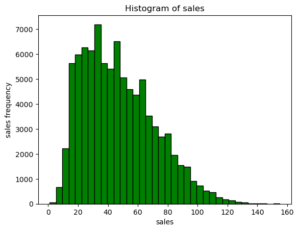
    


**Itemwise daily sales plot**


```python
# Group the data by item
grouped = data.groupby('item')

# Create a figure with a specific size
fig, axs = plt.subplots(10, 5, figsize=(20,15))

# Flatten the array of axes
axs = axs.flatten()

# Loop over the groups and plot the sales for each item
for i, (item, group) in enumerate(grouped):
    axs[i].plot(group['sales'])
    axs[i].set_title(item)

# Tighten the layout to prevent overlapping
fig.tight_layout()

# Show the plot
plt.show()
```


    
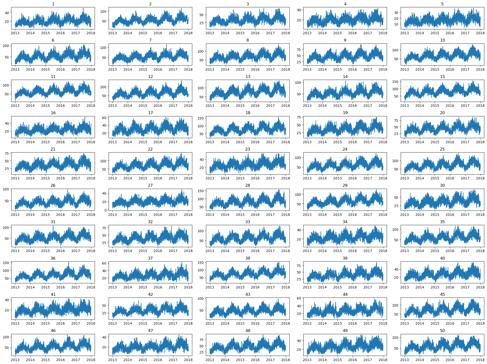
    


**Monthly average sales**


```python
#Resampling the data w.r.t months and taking sales average
monthly_sales = data.resample('M').mean()
```


```python
#Fetching the month names for labels 
month_labels = monthly_sales.index.strftime('%B')
plt.figure(figsize=(15,8))
monthly_sales['sales'].plot(kind='line')
plt.xticks(monthly_sales.index, month_labels, rotation=90)
plt.xlabel('Month')
plt.ylabel('Sales')
plt.title('Monthly Average Sales')
plt.show()
```


    
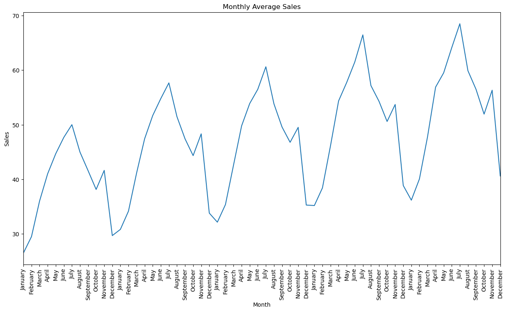
    


```python
# Extract the day of the week from the date index and add it as a new column
data['day_of_week'] = data.index.dayofweek
```

**Average sales on a day of the week**


```python
# Group the data by the day of the week and calculate the mean sales for each day
day_of_week_sales = data.groupby('day_of_week')['sales'].mean()

# Plot the mean sales by day of the week
day_of_week_sales.plot(kind='bar')

# Add labels and title to the plot
plt.xlabel('Day of the Week')
plt.ylabel('Sales')
plt.title('Mean Sales by Day of the Week')

# Show the plot
plt.show()

```


    
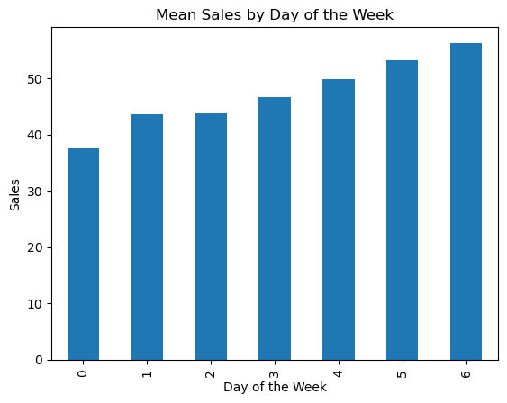
    


**Inferences from EDA**
1. The sales patterns for all the 50 items are almost similar and follow similar seasonal trend
2. There is a seasonal pattern in the sales. Each year the sales are less during the begining of the year,
   and it gradually increases and reach maximum on june-july months and then decreases towards the end of the year
3. Average sales is high on Saturdays and Sundays
4. No. of outliers and their magnitude in the sales for each item is comparitively very less, so they can be retained 


## Resampling the data into weekly sales
* The data is resampled to weekly sales to reduce the noise
* For demand forecasting usually weekly or monthly sales data is taken. 


```python
data = pd.DataFrame(data.groupby('item')['sales'].resample('W').sum())
```


```python
data.reset_index(inplace=True)
```


```python
#data.drop('item',axis=1,inplace=True)
```


```python
data = data.set_index('date')
```


```python
data.head(5)
```


<div>
<style scoped>
    .dataframe tbody tr th:only-of-type {
        vertical-align: middle;
    }

    .dataframe tbody tr th {
        vertical-align: top;
    }

    .dataframe thead th {
        text-align: right;
    }
</style>
<table border="1" class="dataframe">
  <thead>
    <tr style="text-align: right;">
      <th></th>
      <th>item</th>
      <th>sales</th>
    </tr>
    <tr>
      <th>date</th>
      <th></th>
      <th></th>
    </tr>
  </thead>
  <tbody>
    <tr>
      <th>2013-01-06</th>
      <td>1</td>
      <td>73</td>
    </tr>
    <tr>
      <th>2013-01-13</th>
      <td>1</td>
      <td>66</td>
    </tr>
    <tr>
      <th>2013-01-20</th>
      <td>1</td>
      <td>80</td>
    </tr>
    <tr>
      <th>2013-01-27</th>
      <td>1</td>
      <td>70</td>
    </tr>
    <tr>
      <th>2013-02-03</th>
      <td>1</td>
      <td>86</td>
    </tr>
  </tbody>
</table>
</div>


## Feature Engineering

**Adding DateTime features**


```python
data['year'] = data.index.year
data['month'] = data.index.month
data['week_of_year'] = data.index.weekofyear
```


```python
data.head(5)
```


<div>
<style scoped>
    .dataframe tbody tr th:only-of-type {
        vertical-align: middle;
    }

    .dataframe tbody tr th {
        vertical-align: top;
    }

    .dataframe thead th {
        text-align: right;
    }
</style>
<table border="1" class="dataframe">
  <thead>
    <tr style="text-align: right;">
      <th></th>
      <th>item</th>
      <th>sales</th>
      <th>year</th>
      <th>month</th>
      <th>week_of_year</th>
    </tr>
    <tr>
      <th>date</th>
      <th></th>
      <th></th>
      <th></th>
      <th></th>
      <th></th>
    </tr>
  </thead>
  <tbody>
    <tr>
      <th>2013-01-06</th>
      <td>1</td>
      <td>73</td>
      <td>2013</td>
      <td>1</td>
      <td>1</td>
    </tr>
    <tr>
      <th>2013-01-13</th>
      <td>1</td>
      <td>66</td>
      <td>2013</td>
      <td>1</td>
      <td>2</td>
    </tr>
    <tr>
      <th>2013-01-20</th>
      <td>1</td>
      <td>80</td>
      <td>2013</td>
      <td>1</td>
      <td>3</td>
    </tr>
    <tr>
      <th>2013-01-27</th>
      <td>1</td>
      <td>70</td>
      <td>2013</td>
      <td>1</td>
      <td>4</td>
    </tr>
    <tr>
      <th>2013-02-03</th>
      <td>1</td>
      <td>86</td>
      <td>2013</td>
      <td>2</td>
      <td>5</td>
    </tr>
  </tbody>
</table>
</div>


**Note :**
* For further analysis only a single item (here item 1) is considered since all items follow similar 
pattern of sales.
* While fitting the final model all 50 items will be considered.


```python
data_1 = data[data['item']==1]
```


```python
plt.figure(figsize=(16,4))
plt.plot(data_1['sales'],'b')
plt.grid()
plt.title('Weekly Sales of Item 1 of Store 1')
```


    Text(0.5, 1.0, 'Weekly Sales of Item 1 of Store 1')


    
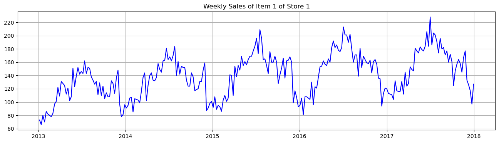
    


**Series Decomposition**


```python
decomposition = sm.tsa.seasonal_decompose(data_1['sales'], model='additive',period=52)
plt.figure(figsize=(12,10))
decomposition.plot()
plt.show()
```


    <Figure size 1200x1000 with 0 Axes>


    
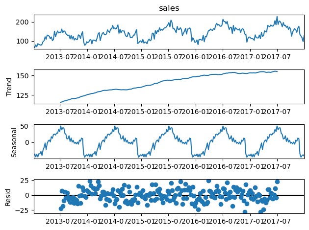
    


**Test for stationarity**

***1. Rolling Statistics***


```python
# Compute the moving average and moving standard deviation of the sales data

roll_mean = data_1['sales'].rolling(window=52).mean()
roll_std = data_1['sales'].rolling(window=52).std()

# Plot the original time series data and the moving average and variance
plt.figure(figsize=(16, 6))
plt.plot(data_1['sales'], label='Original Data')
plt.plot(roll_mean, label='Moving Average')
plt.plot(roll_std, label='Moving Std. Deviation')
plt.legend(loc='best')
plt.title('Rolling Statistics Plot')
plt.grid(True)
plt.show()

```


    
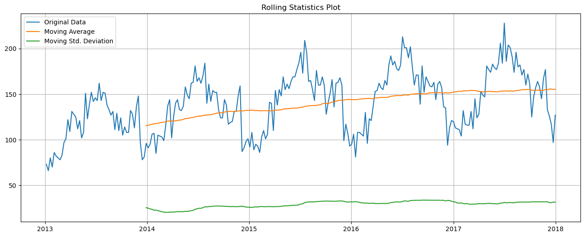
    


***2. Augmented Dickey Fuller test***

           Hypothesis for ADF test for stationarity :
 
            Ho : The series is not stationary

            H1 : The series is stationary

            level of significance: 0.05


```python
result = adfuller(data_1['sales'])
print('ADF Statistics : ',result[0])
print('p-value : ',result[1])
```

    ADF Statistics :  -3.0753361483962967
    p-value :  0.028433087450215576
    

***Inferences :***
1. p-value < 0.05, therefore null hypothesis can be rejected i.e the series is nearly stationary
   

**Auto Correlation Funtion(ACF) and Passive Autocorrelation Function(PACF)**


```python
fig = plt.figure(figsize=(12,8))
ax1 = fig.add_subplot(211)
fig = sm.graphics.tsa.plot_acf(data_1['sales'],lags = 40,ax=ax1)
ax2 = fig.add_subplot(212)
fig = sm.graphics.tsa.plot_pacf(data_1['sales'],lags =40,ax=ax2)
```


    
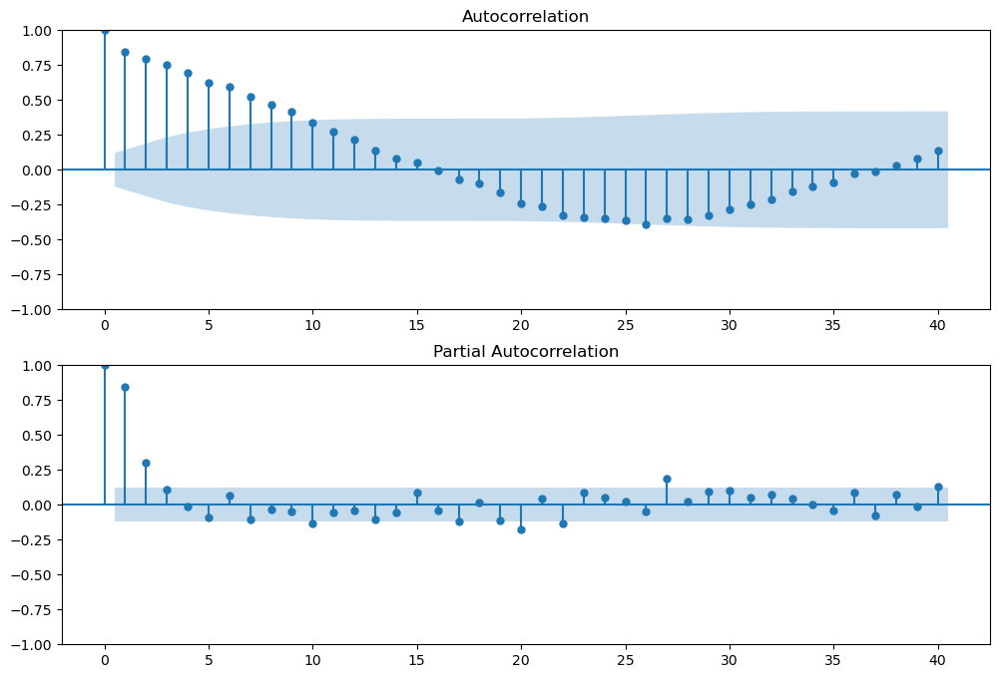
    


```python
# Function to compute performance scores
def evaluate(model,df):
    # Calculate the predictions
    predictions = model.predict()

    # Calculate the actual values
    actual = df.values

    # Calculate mean absolute error (MAE)
    mae = round(np.mean(np.abs(predictions - actual)),2)

    # Calculate mean squared error (MSE)
    mse = round(np.mean((predictions - actual)**2),2)

    # Calculate root mean squared error (RMSE)
    rmse = round(np.sqrt(mse),2)

    # Calculate mean absolute percentage error (MAPE)
    mape = round(np.mean(np.abs((actual - predictions) / actual)) * 100,2)

    # Create a Dataframe to display evalualion matrics values
    evaluate_df = pd.DataFrame({'MAE':mae,'MSE':mse,'RMSE':rmse,'MAPE':mape},index=['Score'])

    return evaluate_df
   
```

**Spliting dataset into training and validation**


```python
data_1_train = data_1.loc[:'2016-12-31']
data_1_val = data_1.loc['2017-01-01':]
```

## ARMA Model


```python
model_arma = sm.tsa.ARIMA(data_1_train['sales'], order=(2, 0, 9))
model_arma_fit = model_arma.fit()
print(model_arma_fit.summary())
```

                                   SARIMAX Results                                
    ==============================================================================
    Dep. Variable:                  sales   No. Observations:                  208
    Model:                 ARIMA(2, 0, 9)   Log Likelihood                -868.918
    Date:                Wed, 22 Feb 2023   AIC                           1763.836
    Time:                        17:41:02   BIC                           1807.224
    Sample:                    01-06-2013   HQIC                          1781.380
                             - 12-25-2016                                         
    Covariance Type:                  opg                                         
    ==============================================================================
                     coef    std err          z      P>|z|      [0.025      0.975]
    ------------------------------------------------------------------------------
    const        134.2041      8.014     16.745      0.000     118.496     149.912
    ar.L1          1.4137      0.363      3.895      0.000       0.702       2.125
    ar.L2         -0.5489      0.306     -1.794      0.073      -1.148       0.051
    ma.L1         -0.8782      0.363     -2.417      0.016      -1.590      -0.166
    ma.L2          0.3076      0.151      2.040      0.041       0.012       0.603
    ma.L3          0.1142      0.121      0.947      0.344      -0.122       0.351
    ma.L4          0.0909      0.133      0.681      0.496      -0.171       0.352
    ma.L5         -0.0512      0.135     -0.378      0.706      -0.317       0.214
    ma.L6          0.2289      0.115      1.993      0.046       0.004       0.454
    ma.L7         -0.0028      0.141     -0.019      0.984      -0.280       0.274
    ma.L8          0.0889      0.107      0.829      0.407      -0.121       0.299
    ma.L9          0.0530      0.141      0.375      0.707      -0.224       0.330
    sigma2       243.7778     22.393     10.886      0.000     199.889     287.667
    ===================================================================================
    Ljung-Box (L1) (Q):                   0.00   Jarque-Bera (JB):                58.03
    Prob(Q):                              0.96   Prob(JB):                         0.00
    Heteroskedasticity (H):               1.20   Skew:                            -0.81
    Prob(H) (two-sided):                  0.45   Kurtosis:                         5.02
    ===================================================================================
    
    Warnings:
    [1] Covariance matrix calculated using the outer product of gradients (complex-step).
    

**Model Evaluation**


```python
evaluate(model_arma_fit,data_1_train['sales'])
```


<div>
<style scoped>
    .dataframe tbody tr th:only-of-type {
        vertical-align: middle;
    }

    .dataframe tbody tr th {
        vertical-align: top;
    }

    .dataframe thead th {
        text-align: right;
    }
</style>
<table border="1" class="dataframe">
  <thead>
    <tr style="text-align: right;">
      <th></th>
      <th>MAE</th>
      <th>MSE</th>
      <th>RMSE</th>
      <th>MAPE</th>
    </tr>
  </thead>
  <tbody>
    <tr>
      <th>Score</th>
      <td>12.03</td>
      <td>260.23</td>
      <td>16.13</td>
      <td>9.72</td>
    </tr>
  </tbody>
</table>
</div>


**Plotting the predictions**


```python
predict_arma = model_arma_fit.predict()
plt.figure(figsize=(16,4))
plt.plot(data_1_train['sales'],label='Original')
plt.plot(predict_arma,label='predictions')
plt.legend(loc='best')
```


    <matplotlib.legend.Legend at 0x203040cba30>


    
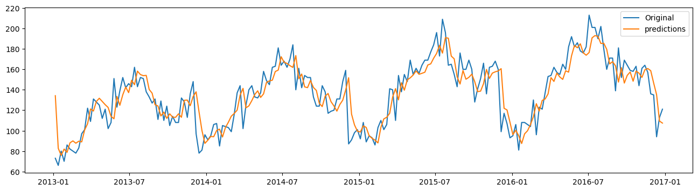
    


**Forecasting on validation set and plotting the forecast**


```python
start_date = '2017-01-01'
end_date = '2017-12-31'
forecast_arma = model_arma_fit.predict(start=start_date,end=end_date)
```


```python
plt.figure(figsize=(16,4))
plt.plot(data_1_val['sales'],label='Original')
plt.plot(forecast_arma,label='predictions')
plt.legend(loc='best')
```


    <matplotlib.legend.Legend at 0x20303fc5460>


    
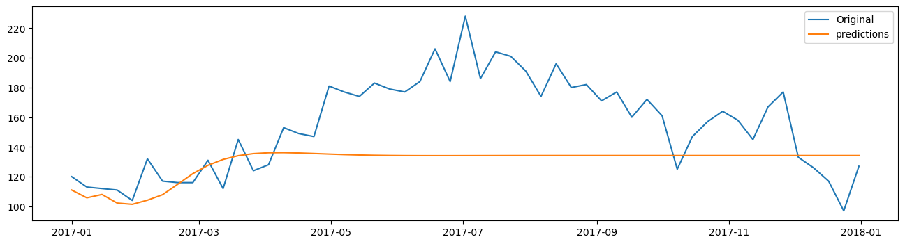
    


**Inferences:**
* The ARMA model was not able to capture the seasonality


## ARIMA Model
* The ADF test showed that the series is stationary, but the series decomposition plots indicated a trend as well as a strong annual seasonality.
Also the rolling statistic test indicated a gradual increase in the mean over time, therefore the series is the first difference of the series is taken to make it stationary.


```python
# Taking the first difference of sales 
fig = plt.figure(figsize=(16,4))
plt.plot(data_1['sales'].diff(1))
```


    [<matplotlib.lines.Line2D at 0x20304061ca0>]


    
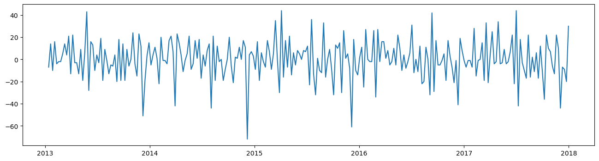
    


```python
model_arima = sm.tsa.ARIMA(data_1_train['sales'], order=(1, 1, 1))
model_arima_fit = model_arima.fit()
print(model_arima_fit.summary())
```

                                   SARIMAX Results                                
    ==============================================================================
    Dep. Variable:                  sales   No. Observations:                  208
    Model:                 ARIMA(1, 1, 1)   Log Likelihood                -870.654
    Date:                Wed, 22 Feb 2023   AIC                           1747.307
    Time:                        17:52:44   BIC                           1757.305
    Sample:                    01-06-2013   HQIC                          1751.350
                             - 12-25-2016                                         
    Covariance Type:                  opg                                         
    ==============================================================================
                     coef    std err          z      P>|z|      [0.025      0.975]
    ------------------------------------------------------------------------------
    ar.L1         -0.0571      0.177     -0.323      0.747      -0.404       0.290
    ma.L1         -0.3582      0.169     -2.123      0.034      -0.689      -0.028
    sigma2       263.3146     20.390     12.914      0.000     223.351     303.278
    ===================================================================================
    Ljung-Box (L1) (Q):                   0.00   Jarque-Bera (JB):                50.60
    Prob(Q):                              0.96   Prob(JB):                         0.00
    Heteroskedasticity (H):               1.27   Skew:                            -0.76
    Prob(H) (two-sided):                  0.33   Kurtosis:                         4.88
    ===================================================================================
    
    Warnings:
    [1] Covariance matrix calculated using the outer product of gradients (complex-step).
    


```python
ax1 = fig.add_subplot(211)
fig = sm.graphics.tsa.plot_acf(data_1['sales'].diff().dropna(),lags = 40,ax=ax1)
ax2 = fig.add_subplot(212)
fig = sm.graphics.tsa.plot_pacf(data_1['sales'].diff().dropna(),lags =40,ax=ax2)

```


```python
predict_arima = model_arima_fit.predict()
plt.figure(figsize=(16,4))
plt.plot(data_1_train['sales'],label='Original')
plt.plot(predict_arima,label='predictions')
plt.legend(loc='best')
```


    <matplotlib.legend.Legend at 0x2030b787eb0>


    
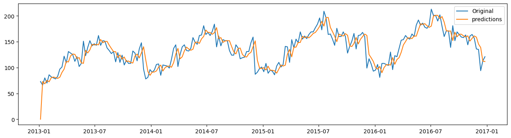
    


**Model Evaluation**


```python
evaluate(model_arima_fit,data_1_train['sales'])
```


<div>
<style scoped>
    .dataframe tbody tr th:only-of-type {
        vertical-align: middle;
    }

    .dataframe tbody tr th {
        vertical-align: top;
    }

    .dataframe thead th {
        text-align: right;
    }
</style>
<table border="1" class="dataframe">
  <thead>
    <tr style="text-align: right;">
      <th></th>
      <th>MAE</th>
      <th>MSE</th>
      <th>RMSE</th>
      <th>MAPE</th>
    </tr>
  </thead>
  <tbody>
    <tr>
      <th>Score</th>
      <td>12.29</td>
      <td>287.72</td>
      <td>16.96</td>
      <td>9.92</td>
    </tr>
  </tbody>
</table>
</div>


```python
residuals = pd.DataFrame(model_arima_fit.resid)
residuals.plot(kind='kde')
plt.grid()
```


    
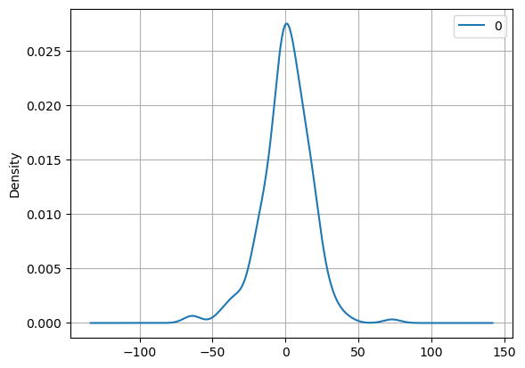
    


**Moldel Validation on test set**


```python
#Setting time frame of test data
start_date = '2017-01-01'
end_date = '2017-12-31'
#Forecating 
forecast_arima = model_arima_fit.predict(start=start_date,end=end_date)
```


```python
# Plotting Forecasted data and real test data
plt.figure(figsize=(16,4))
plt.plot(data_1_val['sales'],label='Original')
plt.plot(forecast_arima,label='predictions')
plt.legend(loc='best')
```


    <matplotlib.legend.Legend at 0x2030c117fa0>


    
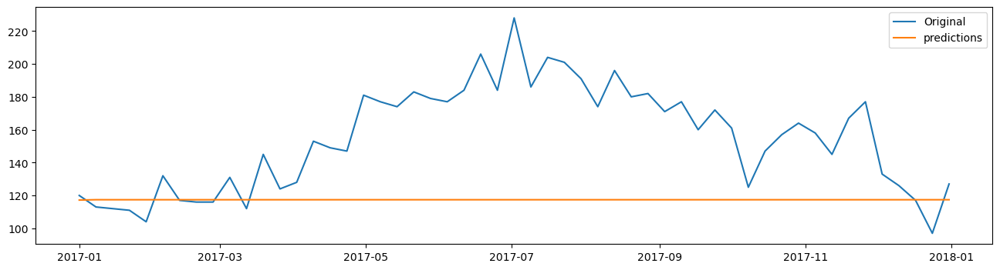
    


## SARIMA Model


```python
order = (1,1,2)
seasonal_order = (2,0,2,52)
```


```python
model_sarima = SARIMAX(data_1_train['sales'],order=order,seasonal_order=seasonal_order,enforce_stationarity=False)
```


```python
model_sarima_fit = model_sarima.fit()
```

**Model Evaluation**


```python
evaluate(model_sarima_fit,data_1_train['sales'])
```


<div>
<style scoped>
    .dataframe tbody tr th:only-of-type {
        vertical-align: middle;
    }

    .dataframe tbody tr th {
        vertical-align: top;
    }

    .dataframe thead th {
        text-align: right;
    }
</style>
<table border="1" class="dataframe">
  <thead>
    <tr style="text-align: right;">
      <th></th>
      <th>MAE</th>
      <th>MSE</th>
      <th>RMSE</th>
      <th>MAPE</th>
    </tr>
  </thead>
  <tbody>
    <tr>
      <th>Score</th>
      <td>12.23</td>
      <td>262.62</td>
      <td>16.21</td>
      <td>9.76</td>
    </tr>
  </tbody>
</table>
</div>


```python
predict_sarima = model_sarima_fit.predict()
plt.figure(figsize=(16,8))
plt.plot(data_1_train['sales'],label='Original')
plt.plot(predict_sarima,label='predictions')
plt.legend(loc='best')
```


    <matplotlib.legend.Legend at 0x2030b890c70>


    
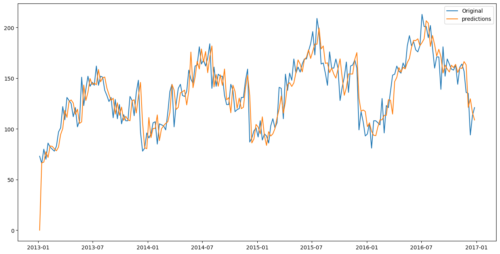
    


```python
start_date = '2017-01-01'
end_date = '2017-12-31'
forecast = model_sarima_fit.predict(start=start_date,end=end_date)
```


```python
plt.figure(figsize=(16,8))
plt.plot(data_1_val['sales'],label='Original',marker='o')
plt.plot(forecast,label='predictions',marker='o')
plt.legend(loc='best')
plt.grid()
```


    
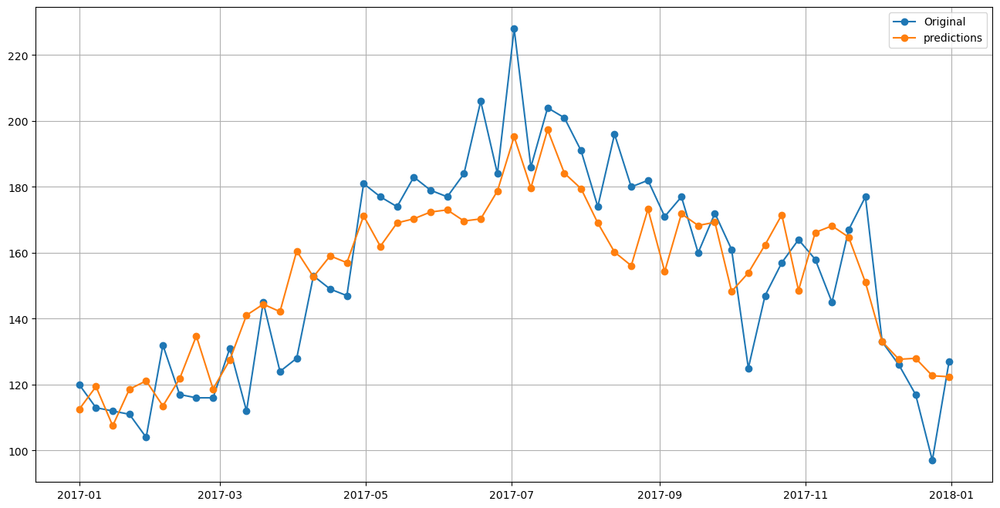
    


**Grid Searching for best Hyperparameters**


```python
import itertools
# define the SARIMA model parameters to search
p = [0, 1, 2]
d = [0,1]
q = [0, 1, 2]
P = [0, 1, 2]
D = [0]
Q = [0, 1, 2]
s = [52]

# create a list with all possible combinations of parameters
params = list(itertools.product(p, d, q, P, D, Q, s))

# define a function to fit a SARIMA model and calculate its RMSE
def sarima_rmse(order, seasonal_order):
        try:
            model = SARIMAX(data_1_train['sales'],order=order,seasonal_order=seasonal_order,enforce_stationarity=False)
            model_fit = model.fit()
            preds = model_fit.predict(start='2017-01-01',end='2017-12-31')
            rmse = np.sqrt(mean_squared_error(data_1_val['sales'], preds))
            return rmse
        except:
            return None


```


```python
# perform a grid search over all possible parameter combinations
best_rmse, best_params = float("inf"), None
for param in params:
    order = (param[0], param[1], param[2])
    seasonal_order = (param[3], param[4], param[5], param[6])
    rmse = sarima_rmse(order, seasonal_order)
    if rmse is not None and rmse < best_rmse:
        best_rmse, best_params = rmse, param

# print the best parameters and the corresponding RMSE
print('Best Parameters:', best_params)
print('RMSE:', best_rmse)
```

    Best Parameters: (1, 1, 2, 2, 0, 2, 52)
    RMSE: 15.895706520798656
    


```python
residuals_sarima = pd.DataFrame(forecast-data_1_val['sales'])
residuals_sarima.plot(kind='kde')
plt.grid()
```


    
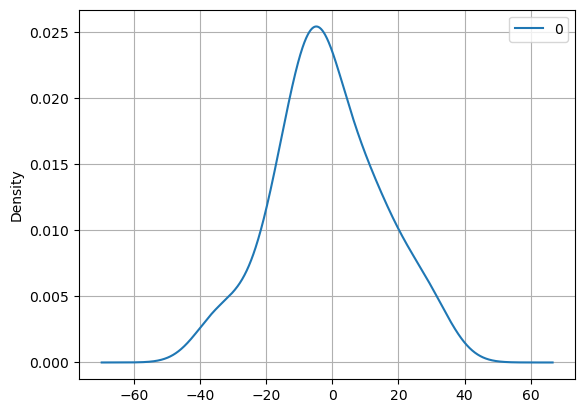
    


**Rolling Mean Forecast**


```python
history = [x for x in data_1_train['sales']]

```


```python
for t in range(len(data_1_val)):
    model_sarima = SARIMAX(history,order=order,seasonal_order=seasonal_order,enforce_stationarity=False)    
    model_sarima_fit = model_sarima.fit()
    output = model_sarima_fit.forecast()
    yhat = output[0]
    predict_arima.append(yhat)
    obs = data_1_val['sales'][t]
    history.append(obs)
```


```python
predict_arima_df = pd.DataFrame(predict_arima,index=data_1_val.index)
```


```python
predict_arima_df.head(5)
```


<div>
<style scoped>
    .dataframe tbody tr th:only-of-type {
        vertical-align: middle;
    }

    .dataframe tbody tr th {
        vertical-align: top;
    }

    .dataframe thead th {
        text-align: right;
    }
</style>
<table border="1" class="dataframe">
  <thead>
    <tr style="text-align: right;">
      <th></th>
      <th>0</th>
    </tr>
    <tr>
      <th>date</th>
      <th></th>
    </tr>
  </thead>
  <tbody>
    <tr>
      <th>2017-01-01</th>
      <td>107.276650</td>
    </tr>
    <tr>
      <th>2017-01-08</th>
      <td>121.604496</td>
    </tr>
    <tr>
      <th>2017-01-15</th>
      <td>111.430005</td>
    </tr>
    <tr>
      <th>2017-01-22</th>
      <td>117.893594</td>
    </tr>
    <tr>
      <th>2017-01-29</th>
      <td>111.133436</td>
    </tr>
  </tbody>
</table>
</div>


```python
rmse = np.sqrt(mean_squared_error(data_1_val['sales'],predict_arima))
print('rmse:',rmse)
plt.plot(data_1_val['sales'])
plt.plot(predict_arima_df,color='red')
plt.show()
```

    rmse: 15.395894086555352
    


    
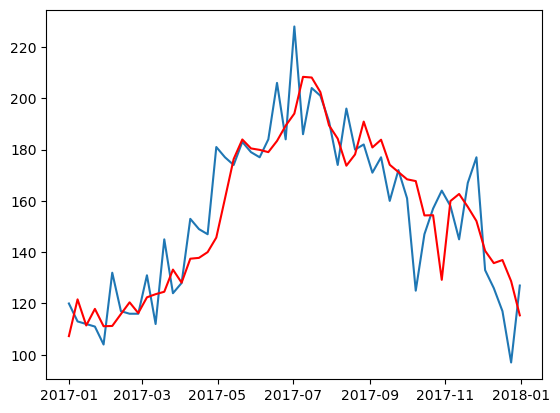
    


```python
residuals_sarima = pd.DataFrame(predict_arima_df[0]-data_1_val['sales'])
residuals_sarima.plot(kind='kde')
plt.grid()
```


    
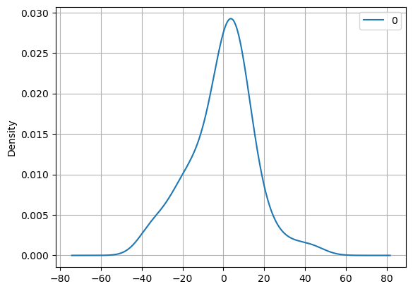
    


# FbProphet Model


```python
import prophet
from prophet import Prophet
```


```python
data_1.head(5)
```


```python
data_1_prophet = data_1[data_1['item']==1]
```


```python
#data_1_prophet = data_1.drop(['item','year','month','week_of_year'],axis=1)
```


```python
data_1_prophet = data_1_prophet.reset_index()
```


```python
data_1_prophet.head(5)
```


```python
data_1_prophet.columns = ['ds','item','y','year','month','week_of_year','first diff']
```


```python
data_1_prophet.head(5)
```


```python
data_1_prophet.shape
```


```python
model_prophet = Prophet()
model_prophet.fit(data_1_prophet)
```


```python
future_dates = model_prophet.make_future_dataframe(periods=365) 
```


```python
prediction_prophet = model_prophet.predict(future_dates)
prediction_prophet.tail()
```


```python
model_prophet.plot(prediction_prophet)
```


```python
from prophet.diagnostics import cross_validation,performance_metrics
```


```python
data_prophet_cv = cross_validation(model_prophet,initial='52W',period='26W',horizon='52W')
```


```python
data_prophet_metrics = performance_metrics(data_prophet_cv)
```


```python
data_prophet_metrics
```

## Linear Regression Model


```python
data_lr = data.copy()
```


```python
data_lr.head(5)
```


```python
X = data_lr.drop('sales',axis=1)
y = data_lr['sales']
```


```python
X_train = X[:'2016-12-31']
X_test = X['2017-01-01':]
y_train = y[:'2016-12-31']
y_test = y['2017-01-01':]
```


```python
from sklearn.linear_model import LinearRegression
```


```python
lr = LinearRegression()
lr = lr.fit(X_train,y_train)
```


```python
lr_predict = lr.predict(X_test)
```


```python
lr_predict
```


```python
from sklearn.metrics import mean_absolute_percentage_error
```


```python
acc = mean_absolute_percentage_error(y_test,lr_predict)
```


```python
acc
```

## Base Model - Holt Winter's Model


```python
from statsmodels.tsa.holtwinters import ExponentialSmoothing

# create and fit the model to the training data
model_base = ExponentialSmoothing(data_1_train['sales'], trend='mul', seasonal='add', seasonal_periods=52)
model_base_fit = model_base.fit()

# make predictions on the test data
predict_base = model_base_fit.predict(start='2017-01-01',end='2017-12-31')

# calculate the mean absolute error (MAE) between the predictions and the actual values
mae = np.mean(np.abs(predict_base - data_1_val['sales']))

print(f"MAE: {mae}")

```

    MAE: 10.663598878146747
    


```python
# Calculate mean squared error (MSE)
mse = round(np.mean((predict_base - data_1_val['sales'])**2),2)

# Calculate root mean squared error (RMSE)
rmse = round(np.sqrt(mse),2)

```


```python
rmse
```


    14.26


```python
mse
```


    203.49


```python

```
